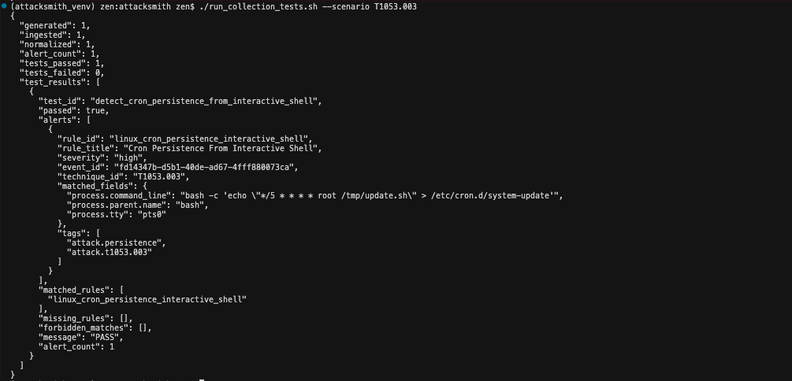

## README.md

Attacksmith is detection pipeline that writes and grades detection rules. Equipped with aits own evaluation engine to ensure your outputs are evaled and quality. 
Below are more details on the main components that make up the project. 

models is the foundation to the rest of the project, the scaffolding. 
It defines the data contracts every other component exchanges

Key components
- RawLogRecord: generator output (source + opaque payload + ATT&CK metadata)
- IngestedRecord: raw + ingestion metadata (id, ingested_at)
- NormalizedEvent: canonical schema for Sigma (event_kind, fields, tags, dotted get())
- Alert: rule match result (rule_id, event_id, matched_fields)
- TestCase / TestResult: harness contract (expected_rules, must_not_match, min_alerts)

From here, a high-level Flow chart is seen at [ATT&CKSMITH.md](./ATT&CKSMITH.md)

This aim is to solve the problem of "does this rule actually detect this threat?"

Given you have the logs for a scenario, test with `./run_collection_test.sh`
For example, `./run_collection_test.sh --scenario T1053.003`

The absence of any arguments will result in all tests by default, as indicated in the help messages. 

If you don't you generate them with log_generator